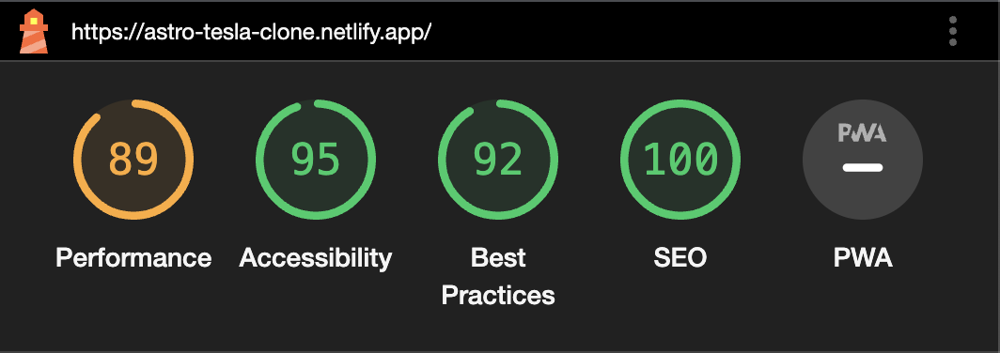
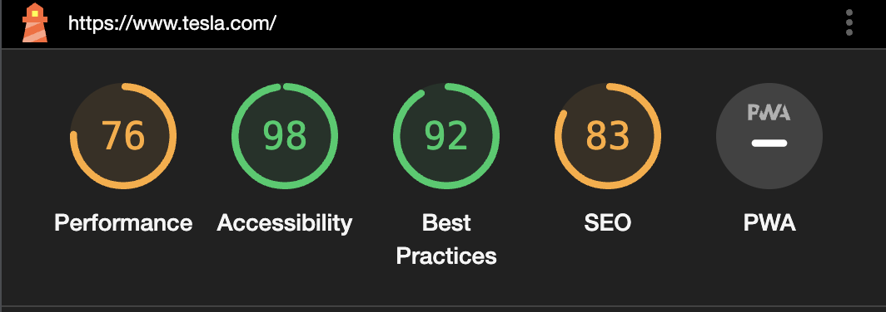

## 🚀 Get Started

You can visit this project at https://astro-tesla-clone.netlify.app/
If you wish to run the project, you should install dependencies with this command

```
pnpm install
```

Once it has installed, you should run the next command

```
pnpm dev
```

Then, open your browser to http://127.0.0.1:3000/

## 🧞 Commands

All commands are run from the root of the project, from a terminal:

| Command                    | Action                                           |
| :------------------------- | :----------------------------------------------- |
| `pnpm install`             | Installs dependencies                            |
| `pnpm run dev`             | Starts local dev server at `localhost:3000`      |
| `pnpm run build`           | Build your production site to `./dist/`          |
| `pnpm run preview`         | Preview your build locally, before deploying     |
| `pnpm run format`          | Run formatter                                    |
| `pnpm run astro ...`       | Run CLI commands like `astro add`, `astro check` |
| `pnpm run astro -- --help` | Get help using the Astro CLI                     |

## 👀 Performance Report

Get a better performance than [Tesla's website](https://www.tesla.com/). Attached some screenshots of the report.

**Performance of the Tesla cloned website**



**Performance of the Tesla Website**


